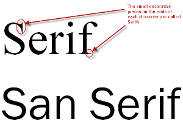

# Fonts und CSS

Ein Font ist eine **Schriftart**. Schriftarten sind auf jedem Desktop Rechner
installiert. Welche habe ich?

-   Windows: Systemsteuerung -> Schritfarten
-   Windows: `<Super-R>` + "fonts"
-   Linux: font-manager

Als Entwickler einer Website muss man davon ausgehen, dass die Benutzer den
gewünschten Font nicht installiert haben, deshalb werden üblicherweise Fonts mit
der Anwendung ausgeliefert. Beispiel CSS:

```css
@font-face {
    font-family: "Inknut Antiqua";
    src: url(fonts/InknutAntiqua-Regular.woff2) format("woff2");
    font-weight: 400;
}
```

Das Font-File wird vom Browser nur dann geladen, wenn ein Text auf der Website
auch tatsächlich entsprechend gestyled ist. Viele Fonts sind frei erhältlich
z.B. von <https://fonts.google.com/>. Sie können heruntergeladen und lokal
installiert werden, aber auch von einer Website ausgeliefert werden. (OFL: Open
Font License) Es gibt jedoch auch kostenpflichtige Fonts. Es ist nicht
empfehlenswert, die `*.ttf` (True-Type-Font) Files an die Browser auszuliefern,
da diese etwa die 3-fache Größe wie das Format `woff2` haben. Es gibt viele
online Konverter (google: _"ttf to woff2 online converter"_). In Linux steht das
Kommando `woff2_compress` zur Verfügung. Youtube Channel von Kevin Powell:
[@KevinPowell](https://www.youtube.com/@KevinPowell) seine
[Videos zu Google fonts](https://youtu.be/zK-yy6C2Nck) und zu
[variablen Fonts](https://www.youtube.com/watch?v=0fVymQ7SZw0) sowie zu den
[hier dargelegten Inhalten](https://youtu.be/Y5TYDo9Qcv4)

## Vorsicht DSGVO - die Notwendigkeit, Fonts selber zu hosten

Es war üblich, Fonts direkt über Google Fonts einzubinden, z.B. so:

```html
<link
    rel="stylesheet"
    href="https://fonts.googleapis.com/css2?family=Aref+Ruqaa+Ink"
/>
```

Dies sollte vermieden werden, denn wenn mein Browser den Font von Google holt,
sieht sein Request etwa so aus:

```code
GET /css2?family=Aref+Ruqaa+Ink HTTP/2
Host: fonts.googleapis.com
Referer: https://www.nicht-dsgvo-konform.at/
```

Nach diesem Request weiß Google, dass ich (meine IP Adresse) zuvor die Website
`https://www.nicht-dsgvo-konform.at/` aufgerufen habe, was die DSGVO verletzt.
Es gibt diesbezüglich etliche laufende Gerichtsverfahren im europäischen Raum,
sowas wollen wir uns ersparen.

## CSS-Attribute

### font-familiy

Die Family ist sozusagen "der Font", Beispiele:

-   Times New Roman
-   Lucida Console
-   Jetbrains Mono
-   Roboto

unspezifischer sind folgende "Überfamilien":

-   serif
-   sans-serif
-   monospaced (alle Zeichen gleich breit, zB. fürs Programmieren)

Was sind Serifen?



Beispiel "font-family":

```css
p {
    font-family: "Segoe UI", Tahoma, Geneva, Verdana, sans-serif;
}
```

Das Argument hier ist ein sogenannter "Font-Stack", das bedeutet: Der Browser
nimmt "das, was er als erstes findet", je nachdem was auf dem Rechner
installiert ist, bzw. mit `@font-face` verfübgar ist. Der Font-Stack geht von
links nach rechts von "very specific" in Richtung "unspecific".

### Das Font Face

Wird in CSS aus font-familiy, font-weight und font-style zusammengesetzt. Um im
Bild zu bleiben: "Ein Face ist ein Familien-Mitglied". Es gibt _kein_
CSS-Attribut "font-face".

### font-weight (Strichdicke)

**bold**, lighter, regular\
Es wird empfohlen mit Zahlen von 100 .. 900 zu arbeiten. Regular ist 400.

### font-style

normal, _italic_

### font-size

Verwende `rem` Values. Steht für "relativ zum root Element". Dies wird vom
Browser definiert. Default: 1rem = 16px;

### text-decoration

unter-, durch- bzw. überstrichen

### line-height (Zeilenabstand)

Ist erlaubt auch ohne Einheiten, analog zu Word.

### text-align

left / center / right

### text-transform

lowercase / uppercase / capitalized

### font-variant

z.B. `small-caps`, `sub`, `super`

## Variable Fonts

Wenn man mit Fonts richtig "herumnerden" möchte, gibt es schließlich die sog.
"variablen Fonts". Diese können entlang unterschiedlicher "Achsen" verändert
werden. Z.B. Ascenders, Descenders, Fillings, Contrasts, etc.. Siehe Video Link
oben. [Axis-Praxis](https://www.axis-praxis.org/)
